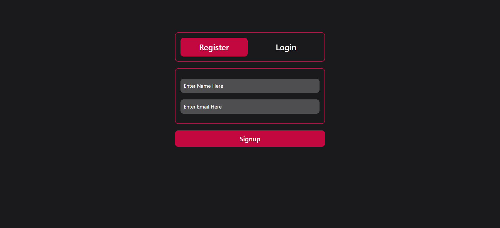
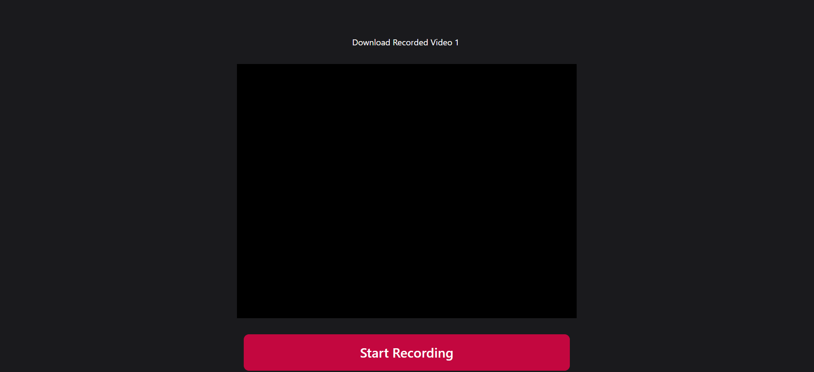

# Recording Project

## Description

It is a feature-rich web application designed to allow users to record videos from their webcam and screen, along with the option to record audio. The app integrates user authentication to provide a personalized experience.

## Deployment

Website is hosted on **Vercel**

```bash
  https://talkvalley-ten.vercel.app/
```

## Features

- User Registration and Authentication
- User Profile Page
- Recording Permissions
- Recording Control
- Video Format Compatibility
- Local Storage
- Download Option
- User Experience


## Tech Stack

- Frontend: React, Chakra UI
- Backend: Express.js, MongoDB
- Authentication: JWT
- Hosting: Vercel

## Installation

1. Clone the repository:
git clone https://github.com/HelloKaushal750/TalkValley.git


2. Navigate to the project directory:


3. Install dependencies for both frontend and backend:
cd frontend
npm install
cd backend
npm install


4. Start the development server:
cd ../frontend
npm run start


5. Open a new terminal window and start the backend server:
cd ../backend
npm run start


6. Access the app in your browser at [http://localhost:3000/](http://localhost:3000/).

## Screenshots

Here are some screenshots of the website:




## Contact

Feel free to contact me at kaushalv079@gmail.com for any questions or inquiries.

